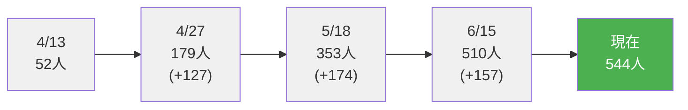

# SNS運用方法：3ヶ月で約500人フォロワー増加

## 概要

現在実施しているSNS運用方法です。本格運用開始（4月：52人）から約3ヶ月間で約500人のフォロワーが増加しました。

## 運用戦略

### 1. 毎日のコンテンツ投稿

- **画像投稿**: 1日1枚（業務委託で作成）
- **動画投稿**: 1日1本（PythonとAIで自動生成）
- 継続的な投稿により、アルゴリズムへの露出とエンゲージメント維持を実現

### 2. 積極的なエンゲージメント活動

- **いいね営業**: 業務委託で対応
- **フォロー活動**: 業務委託で対応
- ターゲット層との接点を増やし、相互フォローを促進

### 3. 効率的な運用体制

- **業務委託**: 子育て中の主婦の友達に運用を委託
  - 画像作成（毎日1枚・AIとCanvaで簡単なスライド作成）
  - いいね営業
  - フォロー活動
  - マーケターやデザイナーではないため委託コストを大幅削減
- **自動化**: 動画はPythonとAIで自動生成
- **Xプレミアム**: アルゴリズムで上位表示されるようアカウントをプレミアムに
- **週次ミーティング**: 毎週15分の打ち合わせで改善点を話し合い、あとは自走
- **コスト削減**: 専門職でない友人への委託で低コスト運用を実現

## 成果

- **期間**: 約3ヶ月（4月中旬〜6月中旬）
- **開始時**: 52人（4月13日）
- **現在**: 544人
- **フォロワー増加数**: 492人
- **運用コスト**: 低コスト運用を実現

## フォロワー増加推移

### フォロワー数の推移

## まとめ

本格運用開始から約3ヶ月で52人から544人へと約10倍に増加。

**運用のポイント**

- 動画の自動生成（Python + AI）で効率化
- AIとCanvaを使った簡単なスライド作成
- Xプレミアムでアルゴリズム上位表示を狙う
- 子育て中の主婦の友達に委託（マーケターやデザイナーではないため低コスト）
- 週15分の打ち合わせのみで、あとは自走する効率的な体制
- 毎日の継続的な投稿とエンゲージメント活動

この方法で運用を続けています。
