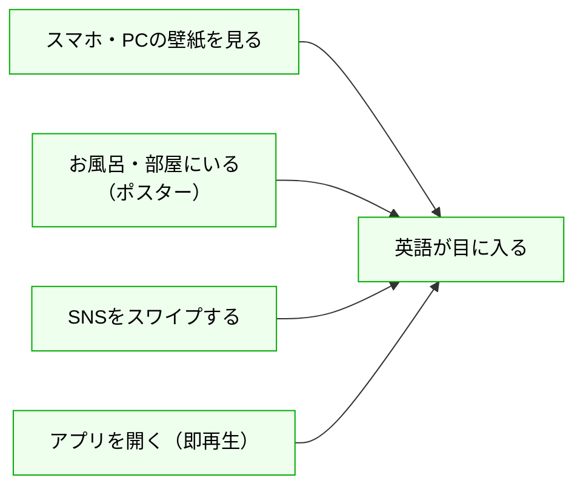
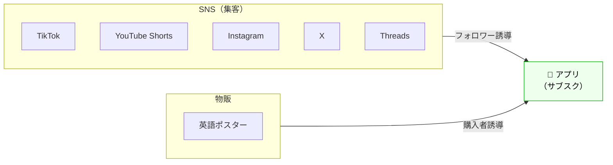

# Sukima Study English ｜ 事業概要

## 課題

学習コンテンツには共通の問題がある。**学習開始までのkvステップが多すぎて、続かない。**

```mermaid
flowchart LR
    A["やる気を出す"] --> B1["アプリを開く"] --> C1["メニューを選ぶ"] --> D1["コンテンツを選ぶ"] --> E["学習開始"]
    A --> B2["本を開く"] --> C2["ページを探す"] --> E
    E --> F["続かない..."]kv
    style A fill:#fee,stroke:#c00,color:#000
    style B1 fill:#fee,stroke:#c00,color:#000
    style C1 fill:#fee,stroke:#c00,color:#000
    style D1 fill:#fee,stroke:#c00,color:#000
    style B2 fill:#fee,stroke:#c00,color:#000
    style C2 fill:#fee,stroke:#c00,color:#000
    style E fill:#efe,stroke:#0a0,color:#000
    style F fill:#fdd,stroke:#c00,color:#000
```

| 問題                              | 詳細                                                                                                           |
| --------------------------------- | -------------------------------------------------------------------------------------------------------------- |
| **リードタイムが長い → 続かない** | 学習アプリは何回もタップしないとコンテンツにたどり着かない。本も開いてページを探す時点で面倒になる。結局やめる |
| **学習体験に一貫性がない**        | SNSの英語系コンテンツは面白いが媒体ごとにバラバラ。体系的に学べない                                            |

---

## コンセプト

**日常生活の中に英語の学習環境をつくる。**



| 方針                         | 詳細                                                                                                               |
| ---------------------------- | ------------------------------------------------------------------------------------------------------------------ |
| **リードタイムをゼロにする** | アプリを開いた瞬間リール動画が自動再生。壁紙DLでロック画面が学習面に。ポスターで浴室や部屋にも英語が自然と目に入る |
| **どこから触れても同じ体験** | SNS・ポスター・アプリのすべてで同じコンテンツ体系を提供                                                            |
| **続けられる仕組み**         | 身の回りに英語へのアクセスポイントを増やし、「勉強しよう」という意思決定を不要にする。学習記録で進捗も可視化       |

---

## プロダクト



### アプリ

TikTok風UIのリール型英語学習アプリ。iOS / Android / Web で提供予定（まずは iOS から）。

スワイプするだけで体系的に英語を学べる。アプリが持つ体系的なコンテンツの一部をSNS向けに最適化して配信するため、SNSで触れた内容がそのままアプリでの学習につながる。

| 学習コンテンツ                                | 機能                           |
| --------------------------------------------- | ------------------------------ |
| 英会話フレーズ / 英単語 / 英文法 / リスニング | 発音テスト / 壁紙DL / 学習記録 |

### SNS

英語フレーズのショート動画・画像を毎日投稿し、フォロワーを獲得する。

TikTok / YouTube Shorts / Instagram / X / Threads

### 物販

Amazon で英語学習ポスターを販売。

| 商品             | 概要                                                           |
| ---------------- | -------------------------------------------------------------- |
| 英語名詞ポスター | A4 × 14枚セット。防水ユポ紙、約1,600語収録。浴室・机上で使える |

---

## 戦略

1. **SNS とポスター販売で認知を広げる** — ショート動画・画像の毎日投稿でフォロワーを獲得しつつ、Amazon ポスターで収益とブランド認知を確保
2. **アプリに集約する** — すべてのチャネルからアプリに誘導し、サブスクで収益化（2026年7月リリース予定）
