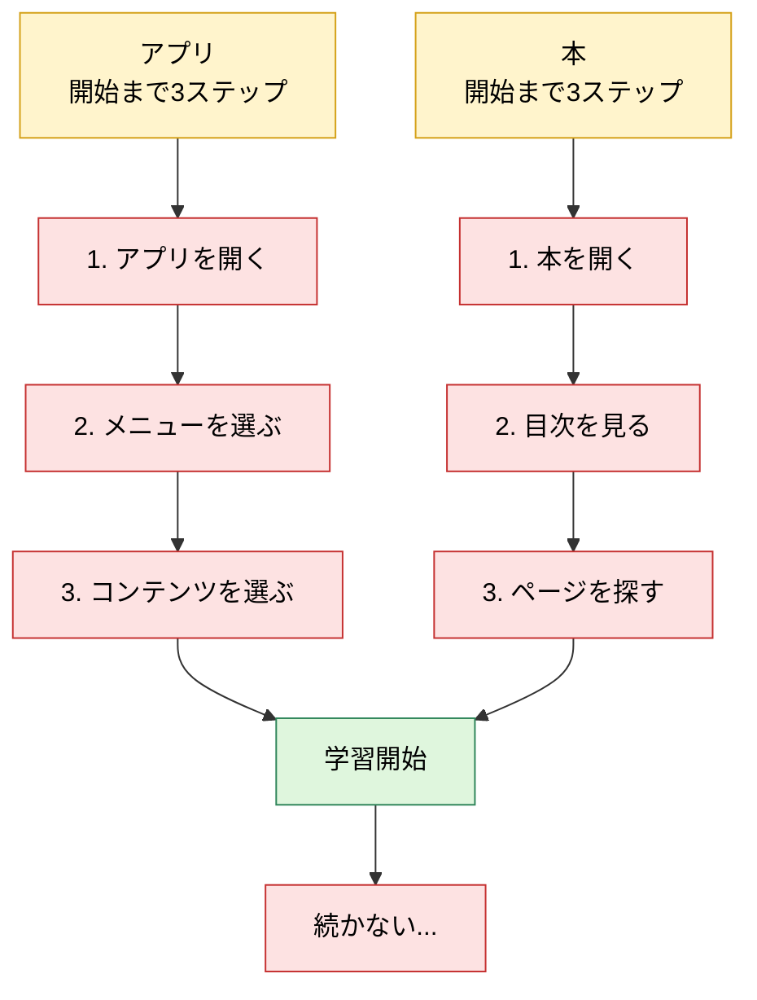
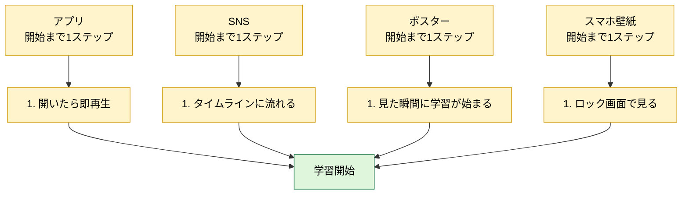
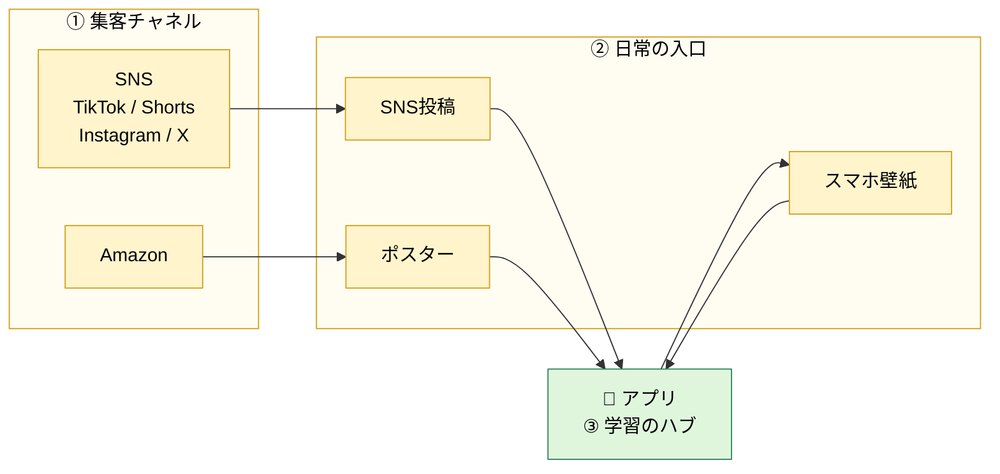
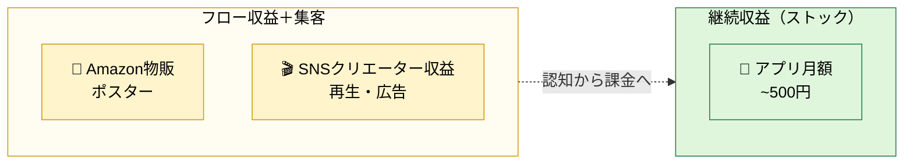

# Sukima Study English ｜ 事業概要

## この事業を始めた理由

円安が進むなかで、収入源を日本だけに頼り続けるのはリスクが高いと感じた。外貨を稼げる状態を早めに作っておきたい。その第一歩として、まず英語を身につけようとした。

ところが、例に漏れず挫折した。やる気はあるのに、**始めるまでの手間が多いだけで続かなくなる。** 「なぜ続かないのか」を突き詰めて考えたことが、この事業の出発点になっている。

## 課題

多くの英語学習コンテンツには共通の弱点がある。やる気があっても、**アプリを開く・本を探す・内容を選ぶ**といった最初の数ステップを越えるだけで力尽きる。**学習が始まる前に、めんどくささに負けてしまう。**

---

## コンセプト

**学習までにかかるステップを限りなく短くする。そのために、英語コンテンツも提供するが、それ以上に日常の中に英語の学習環境をつくることを重視する。**

それぞれの入口には、始めやすい理由がある。

| 入口           | 利点                                                                                       |
| -------------- | ------------------------------------------------------------------------------------------ |
| **アプリ**     | 1タップでショート動画が再生され、その場ですぐ学習が始まる。                                |
| **SNS**        | フォローしていればタイムラインに流れてくるので、わざわざ学びに行かなくていい。             |
| **ポスター**   | A4の防水ポスターなので浴室や部屋のどこにでも貼れ、見た瞬間に学習が始まる。                 |
| **スマホ壁紙** | アプリでDLでき、ロック画面に複数枚入れて切り替えれば、小さな隙間時間でも英語に触れられる。 |

---

## サービス設計

役割は3つ。**外で見つけてもらう（集客）**、**日常の中で触れる接点を増やす（入口）**、**アプリで継続学習に集約する（ハブ）**。アプリを中心に据え、SNS と物販はそこに人を運ぶチャネルとして動かす。

### 📱 アプリ｜学習のハブ

スワイプするだけで英語を学べるリール型アプリ。**外で触れた英語を、ここに集約して継続学習につなげる。** まずは iOS から始める。

- SNSやポスターで気になったフレーズを、そのままアプリで続けて学べる
- 学習記録で「やった量」を可視化し、続ける動機にする
- 壁紙はアプリから配布し、ロック画面そのものを学習の入口に変える

| 学習コンテンツ                    | 機能                         |
| --------------------------------- | ---------------------------- |
| 英会話 / 単語 / 文法 / リスニング | 発音テスト / 壁紙 / 学習記録 |

### SNS｜認知と日常の入口

英語フレーズの短い動画や画像を継続投稿する。フォロワーのタイムラインに自動で流れるので、ユーザーが「学びに行く」必要がない。投稿そのものが学習であり、同時にアプリへの導線でもある。

TikTok / YouTube Shorts / Instagram / X

### 物販｜部屋に置く入口

Amazonで防水ポスターを販売する。浴室や机に貼っておくだけで、見た瞬間に学習が始まる。購入者にはアプリへの導線を同梱し、物理の接点をオンラインの継続学習へつなぐ。

| 商品             | 概要                                |
| ---------------- | ----------------------------------- |
| 英語名詞ポスター | A4 14枚セット。お風呂や机で使える。 |

---

## マネタイズ

3つの柱で収益をつくる。**アプリのサブスクリプション**を主軸の継続収益（ストック）に置き、**物販**と**SNSのクリエーター収益**をフローとして組み合わせる。フロー側はそれ自体が集客チャネルでもあり、サブスクへの入口としても効く。

### 📱 アプリ｜サブスクリプション（月額 〜500円）

英会話・単語・文法・リスニングのリール型コンテンツに加え、発音テスト・学習記録・壁紙ダウンロードを月額で提供する。「日常に英語を仕込み続ける基盤」として、**長く払い続けやすい価格**に置くことを最優先する。

### 🛒 物販｜Amazon

英語ポスター（A4 14枚セット、防水）をAmazonで販売する。物販単体で利益を出しつつ、購入者にはアプリへの導線を同梱し、**サブスクへの入口**にもする。

### 🎬 SNS｜クリエーター収益

TikTok / YouTube Shorts / Instagram / X で英語フレーズの短い動画・画像を継続投稿する。再生数・広告・クリエーターファンドからの収益を得ながら、同時にアプリ・物販への送客も担う。**収益と集客が同じ動きから生まれる**のが強み。
