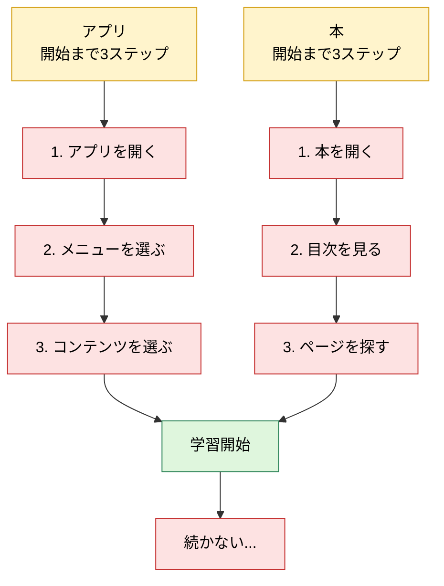
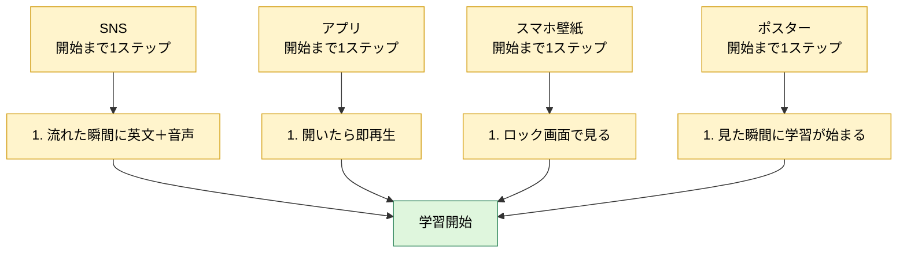
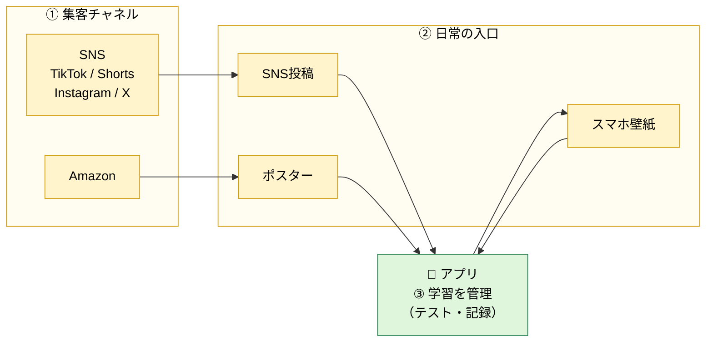
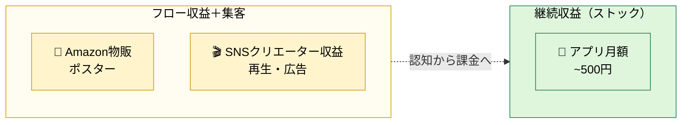

# Sukima Study English ｜ 事業概要

## この事業を始めた理由

円安が進むなかで、収入源を日本だけに頼り続けるのはリスクが高いと感じた。外貨を稼げる状態を早めに作っておきたい。その第一歩として、まず英語を身につけようとした。

ところが、例に漏れず挫折した。なぜ続かないのかを突き詰めて考えてみたら、答えはシンプルだった。**やる気はあっても、始めるまでの手間が多いだけで続かなくなる。** これがこの事業の出発点になっている。

## 課題

多くの学習コンテンツには共通の弱点がある。やる気があっても、**アプリを開く・本を探す・内容を選ぶ**といった最初の数ステップを越えるだけで力尽きる。**学習が始まる前に、めんどくささに負けてしまう。**

---

## コンセプト

**学習までにかかるステップを限りなく短くする。そのために、英語コンテンツも提供するが、それ以上に日常の中に英語の学習環境をつくることを重視する。**

---

## サービス設計

役割は3つ。**集客（見つけてもらう）／入口（日常で触れる）／ハブ（アプリで集約する）**。

- **📱 アプリ｜学習を管理**：SNSで触れたリールの**発音テスト・学習記録**など、外で触れた英語をテスト・管理する（iOS開始）。
- **SNS｜日常の入口**：TikTok / Shorts / Instagram / X に短い動画・画像を継続投稿（=リール本体はここで配る）。
- **物販｜部屋に置く入口**：Amazonで防水ポスター（A4 14枚）を販売。

---

## マネタイズ

**アプリのサブスク**を主軸（ストック）に、**物販**と**SNS収益**をフローとして組み合わせる。フロー側は集客も兼ねる。

- **📱 アプリ｜サブスク（月額〜500円）**：外で触れた英語を**測る・記録する**ことに価値を置く。長く払い続けやすい価格に。
- **🛒 物販｜Amazon**：ポスター販売で利益を出しつつ、サブスクへの入口にもする。
- **🎬 SNS｜クリエーター収益**：投稿で広告収益を得つつ、同じ動きで集客も担う。
